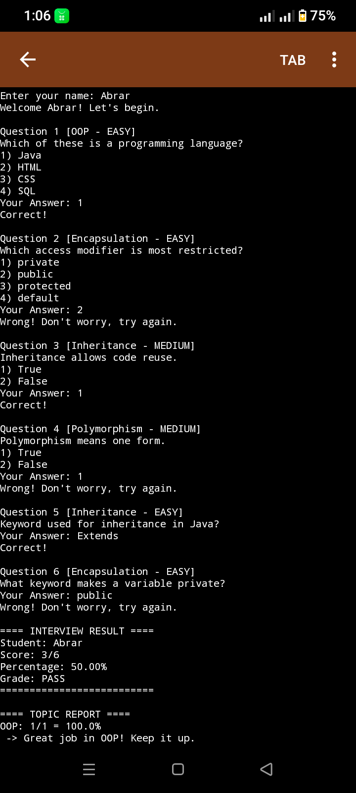
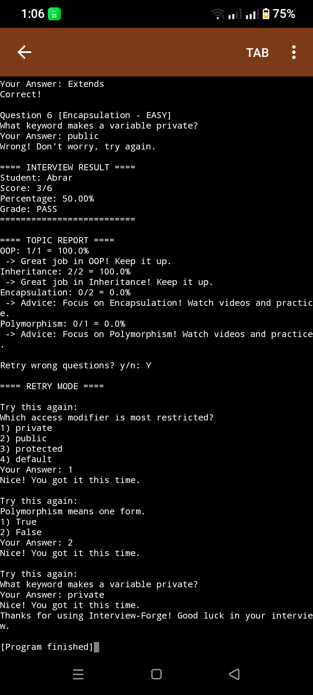

# Interview-Forge

**Built by Abrar**
2nd Year Computer Science Student | August 2026

### Why I Made This
I get really nervous in technical interviews and I kept forgetting OOP concepts.
So I decided to build Interview-Forge to practice every day and track my weak topics.

### Key Features
- **3 Question Types**: MCQ, True/False, Essay
- **Final Score + Grade**: See your percentage and level immediately
- **Topic Report**: See your score in OOP, Inheritance, Encapsulation, Polymorphism
- **Smart Advice**: If you score less than 50% in a topic, the app tells you to study it
- **Retry Mode**: My favorite feature. You can retry all wrong questions at the end

### What I Learned
1. **OOP in Real Project**: First time using abstract classes and inheritance outside of exams.
2. **Debugging**: I had a bug where the program was skipping my answer. I searched on Google and fixed it.
3. **Problem Solving**: I wanted to use HashMap for the topic report but it was confusing for me.
   So I built it with simple loops and it worked. I will learn HashMap later.

### Challenges I Faced
- My percentage was always 0. I forgot to use `100.0` instead of `100`.
- Making the input work correctly with Scanner took me some time.

### How to Run
1. Open Terminal or CMD
2. `javac Main.java`
3. `java Main`

### Screenshots From My Laptop
**1. Running the interview and answering questions**

**2. Final Result + Topic Advice**

---
*Note: I am still adding new features. Next I want to add a timer for each question.*
